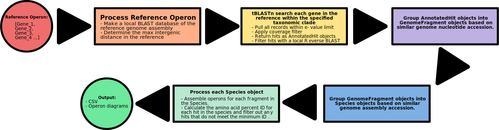

# oprn_consv_calc

**Overview**

The operon_conserve_detect.py script takes a reference operon as a list of genome accessions and will determine its structural conservation (i.e. gene order) within a specific taxonomic clade.

**Pipeline**

**Object Definitions**

**Sample Input**

**Output**

**Usage**

